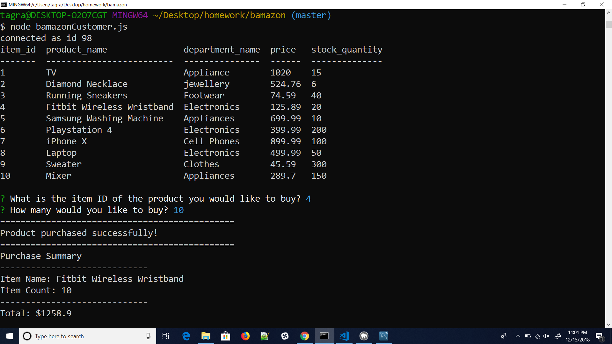
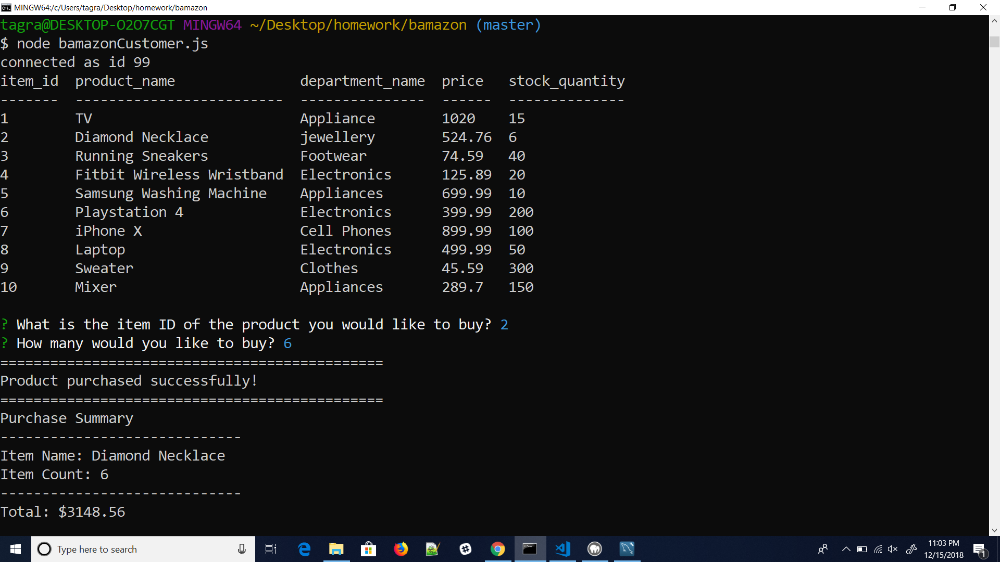
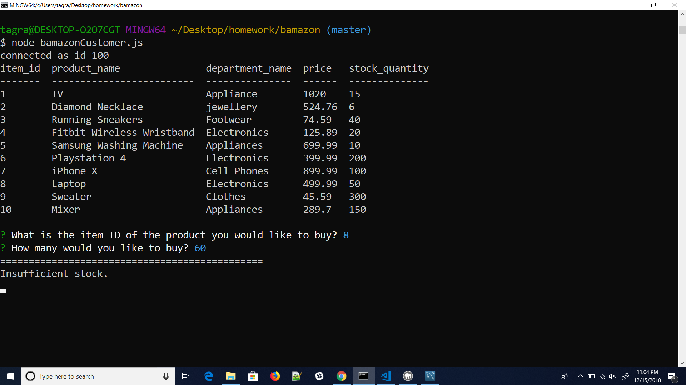

# Welcome to Bamazon!

### About
This is an Amazon-like storefront built with MySQL and Node.js. The app will take in orders from customers.

### What it does
This application will first display all of the items available for sale. Include the ids, names, and prices of products for sale.

The app should then prompt users with two messages.
1. ID of the product user would like to buy.
2. How many units of the product user would like to buy.

Once the customer has placed the order, this application should check if store has enough of the product to meet the customer's request.

1. If store does have enough of the product, it fulfill the customer's order and show the customer the total cost of their purchase..

2. If not, the app should log a phrase like Insufficient quantity!, and then prevent the order from going through.

